# Journal de bord — Projet MAIA

**Équipe :** Nassim EL HADDAD, Eliott Colson, Issam Hamidi, Amélie Buret  
**Projet :** prédiction de sinistres bâtiments (challenge Generali / [Challenge Data](https://challengedata.ens.fr/professors/challenges/19/))  
**Notebook de référence :** `Projet.ipynb`

Ce fichier suit notre avancement au jour le jour : ce qu’on a fait, pourquoi, et ce qu’on prévoit ensuite. Il complète le code sans le remplacer.

> **Pour l’équipe — lecture rapide :** chaque section (1 à 7) comporte *« Comprendre simplement »*, *« Ce qui a été fait concrètement »* (sections 5–7) et *« Graphiques et interprétations »* avec **images** et tableaux « ce qu’on voit / interprétation ». Le reste est plus technique (cellules, outils, chiffres).

---

## Où en est-on ?

| Étape | Statut | Date |
|-------|--------|------|
| 1. Initialisation | Fait | 1 mai 2026 |
| 2. Visualisation des données | Fait | 3 mai 2026 |
| 3. Représentations graphiques | Fait | 5 mai 2026 |
| 4. Modélisation | Fait | 8 mai 2026 |
| 5. Réseau de neurones (MLP) | Fait | 11 mai 2026 |
| 6. K-means (clustering) | Fait | 13 mai 2026 |
| 7. Soumission challenge | Fait | 15 mai 2026 |

---

## Rappel du sujet

On doit estimer la probabilité qu’un bâtiment déclare **au moins un sinistre** pendant sa période d’assurance. La cible `target` vaut 0 (aucun sinistre) ou 1 (au moins un). Le concours classe les modèles avec le **Gini normalisé** : l’important est de bien **ordonner** les bâtiments par risque, pas seulement de viser une accuracy élevée.

Les données sont dans trois CSV à la racine du dossier :

- **`X_train.csv`** — caractéristiques des bâtiments pour l’entraînement (~10 229 lignes)
- **`y_train_saegPGl.csv`** — la cible, reliée par `Identifiant` (même rôle que `y_train.csv` sur le dépôt du cours)
- **`X_test.csv`** — mêmes colonnes que `X_train`, sans cible, pour la soumission finale (~3 412 lignes)

Le détail des variables est dans `description of data and challenge _ français.pdf`.

---

## 1 mai 2026 — Initialisation (section 1 du notebook)

### Ce qu’on voulait faire

Avant toute exploration ou modèle, il fallait mettre en place un environnement reproductible : bibliothèques installées, scripts du cours disponibles, données chargées et fusionnées en un seul tableau de travail `df`. Le notebook d’origine était pensé pour Google Colab (`!wget`) ; on a **gardé ce code** et ajouté des cellules pour travailler **en local** sur Windows.

### Déroulé dans `Projet.ipynb`

En pratique, sur notre machine (Windows, **sans `wget`**), on enchaîne ainsi :

1. **Cellule 3** — installe `seaborn` / `statsmodels` si besoin, puis télécharge les scripts du cours (`urllib`).
2. **Cellule 4** — imports Python et modules du cours (les `!wget` sont **commentés**).
3. **Cellule 5** — `savefigures=False`.
4. **Cellules 7 à 10** — messages informatifs seulement (plus de `wget` / `ls` Colab).
5. **Cellule 12** — lecture des CSV locaux et fusion → `df`.
6. **Cellule 13** — vérification (**après** la cellule 12).

> `wget n'est pas reconnu` : normal sous Windows — suivre l’ordre ci-dessus.  
> `No module named seaborn` : réexécuter la **cellule 3**.

### Cellule 3 — les trois fichiers `.py` du cours

La cellule 3 ne fait pas de modélisation : elle récupère depuis le dépôt [machine-learning-for-networks](https://github.com/andreaaraldo/machine-learning-for-networks) (dossier `course_library`) les utilitaires qu’on réutilisera dans tout le notebook. Une fois téléchargés, ils restent à la racine du projet ; inutile de les retélécharger à chaque session.

#### `andrea_models.py` — modèles et échantillonnage

Ce fichier apporte surtout **`AndreaLinearRegression`**, une régression linéaire compatible **scikit-learn** (`fit`, `predict`) mais calculée avec **statsmodels** (OLS). Intérêt pour nous :

- obtenir un modèle linéaire de base (sections 4.1 à 4.3 du notebook) avec les mêmes habitudes que `sklearn` ;
- afficher un **`summary()`** détaillé (coefficients, p-values, R²) comme en cours de statistiques, ce qu’un `LinearRegression` sklearn ne donne pas directement.

Il contient aussi des helpers **`subsample`** / **`subsample_two_arrays`** pour tirer un sous-échantillon aléatoire de lignes (utile si on veut tester du code sur un petit jeu avant de lancer tout le train).

**Dans notre projet :** utilisé dès les régressions exploratoires sur `superficief`, `EXPO`, etc., avant de passer aux classifieurs (logistique, forêt aléatoire).

#### `feature_engineering.py` — repérer les variables utiles

Bibliothèque d’**analyse de variables**, pas de nettoyage automatique des CSV. Les fonctions principales :

| Fonction | Utilité |
|----------|---------|
| **`low_var_features(df, threshold)`** | Liste les colonnes dont la **variance** dépasse un seuil — repère les variables quasi constantes (peu informatives). |
| **`get_most_correlated(df)`** | Classe les **paires de variables** numériques par corrélation de Pearson décroissante — repère la redondance (deux features qui disent la même chose). |
| **`get_features_correlated_to_target(df, target_feature)`** | Classe chaque variable numérique selon sa **corrélation avec la cible** — voir rapidement ce qui est lié au sinistre (en régression ; pour la classification binaire, c’est indicatif). |

**Dans notre projet :** aide à l’EDA et au choix des variables avant modélisation, en complément des heatmaps du notebook.

#### `visualization.py` — graphiques prêts pour le ML

Regroupe des fonctions de **visualisation** (matplotlib / seaborn) pour ne pas tout recoder à chaque fois :

| Fonction | Utilité |
|----------|---------|
| **`plot_corr`** | Heatmap des **corrélations** entre variables (triangle supérieur, seuil optionnel). |
| **`rotate_labels`** | Pivoter les labels d’une **scatter matrix** pour la lisibilité. |
| **`plot_conf_mat`** | **Matrice de confusion** lisible (normalisée ou non) — celle qu’on importe explicitement en cellule 4. |
| **`plot_feature_importances`** | Barres des **importances** (forêt aléatoire, etc.). |
| **`plot_rf_classification_dashboard`** | Tableau de bord RF : matrice (effectifs + %), rappel/précision, courbe PR, top importances. |
| **`silhouette_diagram`** | Qualité des **clusters** (K-means, section 6 du notebook). |
| **`plot_roc_curve`**, **`plot_precision_recall_curve`**, etc. | Courbes **ROC / précision-rappel** pour évaluer un classifieur ou un détecteur d’anomalies. |

**Dans notre projet :** `plot_conf_mat` après la régression logistique et la forêt aléatoire ; le reste au fil des sections (corrélations, clustering, anomalies).

> Ces fichiers viennent du cours ; on ne les modifie pas sauf besoin ponctuel. Ils dépendent de `pandas`, `numpy`, `sklearn`, `statsmodels` (`andrea_models`) et `seaborn` (`visualization`).

### Bibliothèques importées — à quoi elles servent

#### Outils standards (cellule d’imports)

| Import | Rôle dans notre projet |
|--------|-------------------------|
| **`pandas` (`pd`)** | Cœur du projet : lire les CSV, manipuler les tableaux (`DataFrame`), fusionner train et cible, nettoyer les colonnes, préparer les jeux pour les modèles. |
| **`numpy` (`np`)** | Calculs numériques sur les tableaux (vecteurs, matrices), opérations vectorielles plus rapides que des boucles Python. |
| **`matplotlib.pyplot` (`plt`)** | Tracer graphiques (boxplots, courbes, nuages de points) pour comprendre les données et illustrer les résultats. |
| **`%matplotlib inline`** | Affiche les graphiques directement sous les cellules du notebook (indispensable en Jupyter / VS Code). |
| **`sklearn.model_selection.train_test_split`** | Séparer les données en sous-ensembles d’entraînement et de test pour évaluer un modèle sans tricher sur tout le jeu. |
| **`sklearn.model_selection.cross_val_score`** et **`KFold`** | Validation croisée : entraîner et tester sur plusieurs découpes pour une estimation plus stable des performances. |
| **`sklearn.metrics.mean_squared_error`** | Mesurer l’erreur quadratique moyenne (RMSE via `math.sqrt`) — utilisée dans les parties **régression** du notebook. |
| **`math`** | Fonctions mathématiques simples (ex. `sqrt` pour passer de MSE à RMSE). |
| **`pickle`** | Sauvegarder et recharger des objets Python (modèles entraînés, préprocesseurs) sur le disque. |
| **`pandas.plotting.scatter_matrix`** | Matrice de scatter plots : voir d’un coup les relations entre plusieurs variables numériques. |
| **`statistics.mean`** | Moyenne arithmétique sur des listes Python (complément léger à NumPy/Pandas). |

#### Modules du cours (importés en cellule 4, téléchargés en cellule 3)

| Import | Fichier | En bref |
|--------|---------|---------|
| **`AndreaLinearRegression`** | `andrea_models.py` | Régression linéaire OLS + résumé statistique — voir section *Cellule 3* ci-dessus. |
| **`import feature_engineering`** | `feature_engineering.py` | Corrélations, variance faible — repérage de variables. |
| **`plot_conf_mat`** | `visualization.py` | Matrices de confusion et autres graphes ML — voir section *Cellule 3*. |

#### Utilisés dans les cellules locales (hors cellule 4)

| Import | Rôle dans notre projet |
|--------|-------------------------|
| **`pathlib.Path`** | Chemins vers les CSV et scripts de façon portable (Windows, Linux), sans concaténer des chaînes à la main. |
| **`urllib.request`** | Télécharger les `.py` du dépôt GitHub du cours quand on n’est pas sur Colab. |

#### Dépendance indirecte

- **`statsmodels`** — non importée directement dans le notebook, mais **requise** par `andrea_models.py`. À installer avec :  
  `pip install statsmodels`

Pour tout installer d’un coup :

```bash
pip install pandas numpy matplotlib seaborn scikit-learn statsmodels imbalanced-learn
```

(`seaborn` pour `visualization.py` ; `imbalanced-learn` plus tard pour **SMOTE**.)

### Chargement des données (rappel du code)

```python
from pathlib import Path

DATA_DIR = Path(".")

X_train = pd.read_csv(DATA_DIR / "X_train.csv", index_col=0)
X_test = pd.read_csv(DATA_DIR / "X_test.csv", index_col=0)
y_train = pd.read_csv(DATA_DIR / "y_train_saegPGl.csv", index_col=0)

df = X_train.merge(y_train, on="Identifiant")
```

`df` est le tableau qu’on utilisera pour l’exploration : une ligne par bâtiment, les features **et** `target`.

### Ce qu’on a constaté après exécution

- **10 229** bâtiments en entraînement, **3 412** en test.
- Après fusion : **`df`** fait **(10229, 26)** colonnes.
- Environ **22,7 %** des bâtiments ont `target = 1` : classe minoritaire plus rare, ce qui guidera nos choix plus tard (SMOTE, métriques adaptées, Gini).
- `Identifiant` ne doit **pas** entrer dans le modèle : c’est un ID technique, utile seulement pour la jointure et la soumission.

---

## 3 mai 2026 — Visualisation des données (section 2 du notebook)

### Ce qu’on voulait faire

Avant de tracer des boxplots ou d’entraîner des modèles, on devait **comprendre le jeu de données** : structure du tableau, types de colonnes, valeurs manquantes, déséquilibre de `target`, et premiers signaux sur les variables importantes (`EXPO`, `superficief`, etc.). La section 2 du notebook servait surtout de passage rapide (`head`, `info`, `dropna`) ; on l’a **enrichie** tout en gardant le code d’origine.

### Comprendre simplement — « On ouvre la boîte et on regarde ce qu’il y a dedans »

Imagine **10 229 fiches bâtiment** : superficie, année, code postal, etc. Pour chaque fiche on veut savoir : **est-ce qu’il y a eu au moins un sinistre ?** (`target` = 0 non, 1 oui).

#### 1. Utiliser la bonne table (`df` avec la cible)

**Avant :** le notebook rechargeait seulement les caractéristiques du bâtiment, **sans** la colonne sinistre.  
**Maintenant :** on travaille sur **`df`** = caractéristiques **+** sinistre ou non.

| Bâtiment (exemple) | Superficie | Sinistre (`target`) |
|--------------------|------------|---------------------|
| Immeuble A | 1 500 m² | 0 (non) |
| Immeuble B | 800 m² | 1 (oui) |

Sans `target`, impossible d’apprendre à prédire les sinistres.

#### 2. Compter les « trous » dans les fiches

Certaines lignes ont des cases vides.

| Colonne souvent vide | Nombre de trous (ordre de grandeur) |
|----------------------|-------------------------------------|
| `ft_22_categ` (souvent une année) | ~1 236 |
| `superficief` | ~119 |
| `Insee` (code géographique) | ~115 |

**En tout :** ~1 351 fiches ont **au moins une** case vide → environ **13 %** du jeu.

#### 3. Nettoyer avec `dropna()` — on enlève les fiches incomplètes

Comme une pile de dossiers : on retire ceux où il manque une info importante.

- **Avant :** 10 229 fiches  
- **Après :** **8 878** fiches complètes  
- **Retirées :** 1 351 fiches

C’est un choix du notebook de cours (simple). Plus tard on pourrait imputer les valeurs manquantes au lieu de supprimer.

#### 4. Le déséquilibre des sinistres — peu de « 1 »

Sur 100 bâtiments environ, **23** ont eu un sinistre et **77** non.

**Pourquoi c’est important :** un modèle « paresseux » qui dit toujours « pas de sinistre » aurait l’air bon (~77 % de bonnes réponses) mais serait **inutile** pour l’assureur. On devra y faire attention en modélisation (SMOTE, métrique Gini, etc.).

#### 5. Premières pistes (chiffres)

| Observation | Exemple / sens |
|-------------|----------------|
| **`EXPO` en texte** | `"1"` = assuré toute l’année, `"0,5"` = six mois → à convertir en nombre en section 3 |
| **`superficief`** | Variable la plus liée au sinistre dans nos calculs (~0,30 de corrélation) — les grands bâtiments semblent un peu plus à risque (à confirmer avec les modèles) |
| **Colonnes en lettres** | Beaucoup de `V` / `N` / `O` → le modèle ne comprend pas les lettres ; encodage en section 3 |

**En une phrase :** la section 2, c’est l’**inventaire** du jeu de données avant de dessiner ou d’entraîner un modèle.

### Graphiques et interprétations (section 2)

> Figures générées à partir des données du projet (dossier `figures/`). Pour les régénérer : `python generate_figures.py`.

#### Déséquilibre de la cible `target`

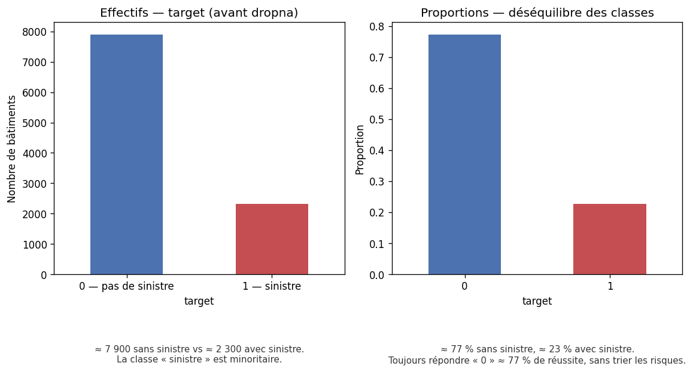

| Graphique | Interprétation courte |
|-----------|------------------------|
| **Gauche (effectifs)** | ≈ **7 900** bâtiments sans sinistre vs ≈ **2 300** avec sinistre — la classe sinistre est **minoritaire**. |
| **Droite (proportions)** | ≈ **77 %** sans sinistre, **23 %** avec — un modèle qui répond toujours « 0 » aurait ~77 % de bonnes réponses **sans être utile**. |

**Pourquoi on cite Gini et SMOTE plus tard :** l’accuracy compte les bonnes réponses ; le **Gini** vérifie surtout si les vrais sinistres sont **bien classés en tête de liste**. Le **SMOTE** aide l’entraînement à ne pas ignorer les 23 % de sinistres rares.

#### Valeurs manquantes

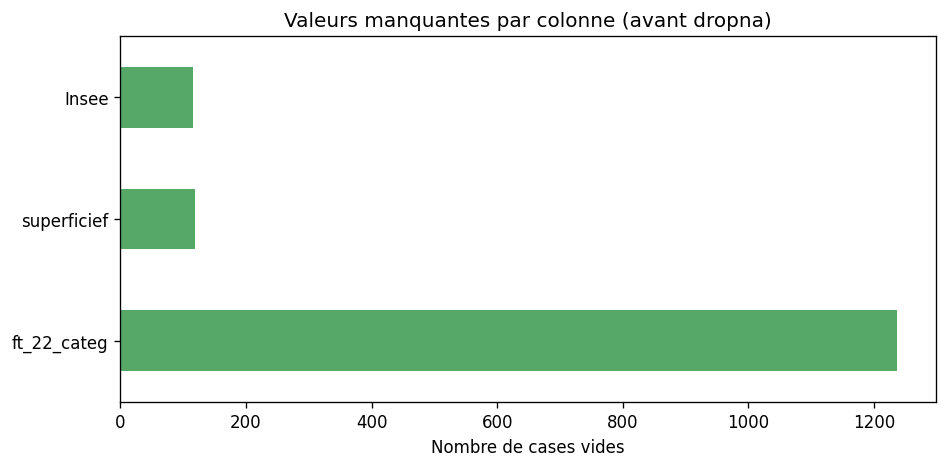

| Ce qu’on voit | Interprétation |
|---------------|----------------|
| `ft_22_categ` en tête | C’est la colonne qui manque le plus souvent → beaucoup de fiches perdues à cause d’elle au `dropna()`. |
| `superficief` et `Insee` ensuite | Autres trous importants ; le code postal (`Insee`) peut être utile plus tard (données externes). |
| ~1 351 lignes touchées au total | On passe de 10 229 à **8 878** lignes après nettoyage. |

---

### Déroulé dans `Projet.ipynb`

| Cellule | Action |
|---------|--------|
| **15** | On part du **`df` fusionné** (section 1), pas d’un rechargement de `X_train` seul — sinon on perd `target`. |
| **16–17** | `head()` et `info(verbose=True)` : premiers aperçus, types (`object` vs numériques). |
| **18** | Dimensions + copie **`df_raw`** avant nettoyage. |
| **19–20** | `dropna()` : suppression des lignes avec au moins un manquant ; affichage du nombre de lignes perdues et de la répartition de `target` après nettoyage. |
| **22** | Comptage des **manquants par colonne** sur `df_raw`. |
| **23** | **Barplots** de `target` (effectifs et proportions) — visualiser le déséquilibre des classes. |
| **24** | `describe()` sur les colonnes numériques clés. |
| **25** | Focus sur **`EXPO`** (stocké en texte, virgules décimales). |
| **26** | **`feature_engineering.get_features_correlated_to_target`** : corrélations numériques avec `target`. |
| **27** | Exemple catégoriel : `value_counts` sur `ft_5_categ`. |

### À quoi servent les opérations de cette étape

| Méthode / outil | Rôle |
|-----------------|------|
| **`df.head()`** | Voir concrètement quelques lignes (valeurs `V`/`N`, codes INSEE, etc.). |
| **`df.info()`** | Lister colonnes, types, et compter les non-null — repère rapide des manquants. |
| **`df.shape`** | Nombre de lignes / colonnes avant et après nettoyage. |
| **`df.dropna()`** | Retirer les bâtiments incomplets ; on accepte de perdre des lignes pour simplifier la suite du notebook (choix du code initial). |
| **`df.isna().sum()`** | Quantifier **où** sont les trous (quelle colonne pose problème). |
| **`value_counts` / barplots** | Mesurer le **déséquilibre** sinistre / pas sinistre — crucial pour la classification plus tard. |
| **`describe()`** | Résumé statistique (moyenne, quartiles, min/max) des variables numériques. |
| **`feature_engineering`** | Prioriser les variables numériques les plus liées à `target` (indicatif, pas causal). |

### Ce qu’on a constaté

**Avant `dropna()`** — 10 229 lignes, 26 colonnes.

| Constat | Détail |
|---------|--------|
| **Manquants** | Surtout `ft_22_categ` (1 236), `superficief` (119), `Insee` (115) — **1 351 lignes** ont au moins une valeur manquante (~13,2 %). |
| **Déséquilibre** | ~22,7 % de `target = 1` (cohérent avec l’init). |
| **`EXPO`** | Colonne **texte** : souvent `"1"`, mais aussi des fractions avec **virgule** (`"0,246575342"`) → conversion en float prévue en section 3. |
| **Catégorielles** | Beaucoup de colonnes en `object` (`ft_5_categ` : surtout `V` et `N`) — encodage nécessaire avant les modèles sklearn. |

**Après `dropna()`** — **8 878 lignes** (1 351 supprimées).

| Variable | Observation |
|----------|-------------|
| **`target`** | 2 038 sinistres / 6 840 non-sinistres (~23,0 % de 1) — le déséquilibre reste marqué. |
| **`superficief`** | Moyenne ~1 899 m², forte dispersion (max > 30 000) — valeurs extrêmes à surveiller aux boxplots. |
| **Corrélations numériques avec `target`** | Les plus élevées en valeur absolue : `superficief` (~0,30), puis `ft_21_categ`, `ft_19_categ`, `ft_4_categ` — piste pour la modélisation ; le PDF du challenge cite aussi `ft_22_categ` et `EXPO`. |

Le tableau **`df`** nettoyé alimente la section 3 ci-dessous.

---

## 5 mai 2026 — Représentations graphiques (section 3 du notebook)

### Ce qu’on voulait faire

Après l’inventaire des données (section 2), on a **visualisé** les variables numériques clés pour repérer outliers, formes de distributions et premières relations avec les sinistres. On a aussi **préparé** un jeu encodé (`df_cleaned`) pour la modélisation (section 4).

### Comprendre simplement — « On dessine pour mieux comprendre »

On garde les **8 878 fiches** propres de la section 2, et on les **regarde en graphiques** pour voir formes, valeurs extrêmes et liens avec les sinistres.

#### 1. Les boîtes à moustaches (boxplots) — où est la « normale » ?

Un boxplot résume : médiane, quartiles, et les **points isolés** = valeurs très différentes du reste (**outliers**).

**Exemple `superficief` (superficie en m²) :**

- La majorité des bâtiments : autour de **500 à 2 000 m²**
- Quelques monstres à **30 000 m²** → points tout en haut du graphique
- **Conclusion :** la superficie est très **étalée** ; quelques énormes bâtiments tirent les stats vers le haut

**Exemple `ft_2_categ` :** ce sont surtout des **années** (2012–2016) → on utilise un **histogramme** plutôt qu’un boxplot (peu de surprise).

#### 2. Corriger `EXPO` — temps d’assurance sur l’année

`EXPO` = fraction de l’année où le bâtiment était assuré.

| Valeur lue dans le CSV | Signification |
|------------------------|---------------|
| `"1"` ou `1.0` | Année complète |
| `"0,5"` → `0.5` | Environ 6 mois |
| `"0"` | Très peu ou pas couvert sur la période |

**Ce qu’on a vu :** environ **76 %** des lignes ont `EXPO = 1` (la plupart des contrats sont des années pleines).

#### 3. Les histogrammes — combien de bâtiments par tranche ?

Des barres = effectifs par intervalle de valeur. Avec **`bins=3`**, on ne garde que 3 grandes tranches → vue très simplifiée pour repérer où se concentre la masse.

#### 4. La heatmap des corrélations — « qui bouge avec qui ? »

Carte colorée : si deux colonnes montent ou descendent **ensemble**, corrélation forte.

**Exemples à lire sur la figure :**

- **`superficief` et `target`** : assez liés → les plus grands bâtiments sont un peu plus souvent en sinistre (simplifié)
- Deux variables très corrélées entre elles → peut‑être redondantes ; une seule suffira peut‑être au modèle

#### 5. Superficie selon sinistre ou non (boxplot par `target`)

Deux boîtes côte à côte :

| `target` | Lecture |
|----------|---------|
| **0** | Bâtiments **sans** sinistre — médiane de superficie plus basse |
| **1** | Bâtiments **avec** sinistre — médiane un peu plus haute |

Ça **confirme visuellement** ce qu’on avait vu en chiffres en section 2.

#### 6. La scatter matrix — nuages de points par paires

Chaque petit graphique = une variable en X, une en Y (superficie vs année, EXPO vs superficie, etc.). Utile pour repérer des formes (nuage, ligne, rien).

#### 7. `df_cleaned` — préparer le tableau pour sklearn

Les modèles du cours ne lisent pas directement `V`, `N`, `O` ou des codes texte.

**Exemple simplifié :**

| Avant (`ft_5_categ`) | Après encodage (one-hot) |
|----------------------|---------------------------|
| `V` | colonne `ft_5_V` = 1, `ft_5_N` = 0 |
| `N` | `ft_5_V` = 0, `ft_5_N` = 1 |

**Résultat :** **8 878 lignes × 1 505 colonnes** (beaucoup de colonnes 0/1). C’est ce jeu qu’on utilisera en grande partie pour la **section 4 — modélisation**.

> **`Identifiant`** n’est pas encodé : c’est le numéro de dossier, pas une caractéristique du bâtiment.

**En une phrase :** la section 3, c’est **voir** les données (formes, extrêmes, liens avec le sinistre) et **transformer** le tableau pour que les algorithmes puissent l’utiliser.

#### Lien entre les parties 2 et 3

| | Section 2 | Section 3 |
|---|-----------|-----------|
| **Style** | Tableaux, comptages | Graphiques |
| **Question** | Combien ? Quoi manque ? | À quoi ça ressemble ? |
| **Sortie** | `df` nettoyé (8 878 lignes) | Même `df` + `df_cleaned` (1 505 colonnes) |

**Analogie :** section 2 = lire toutes les fiches ; section 3 = les afficher au mur en schémas avant de construire le modèle prédictif.

### Graphiques et interprétations (section 3)

> Données : jeu **après `dropna()`** (8 878 bâtiments). Figures dans `figures/`.

#### Superficie (`superficief`)

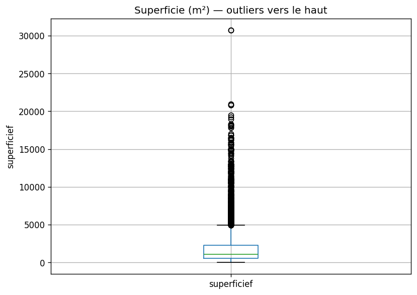

| Ce qu’on voit | Interprétation |
|---------------|----------------|
| Boîte compacte en bas | La plupart des bâtiments font **quelques centaines à ~2 000 m²**. |
| Points isolés au-dessus | **Outliers** : très grands bâtiments (jusqu’à ~30 000 m²) qui tirent la moyenne vers le haut. |
| Pour le modèle | Penser à normaliser ou traiter les extrêmes ; la superficie reste une variable importante. |

#### Exposition (`EXPO`)

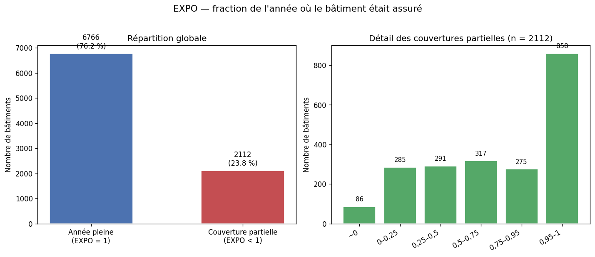

| Ce qu’on voit | Interprétation |
|---------------|----------------|
| Barre « année pleine » dominante | **~76 %** des contrats couvrent **l’année entière** (`EXPO = 1`). |
| Barres des tranches partielles | **~24 %** de couvertures incomplètes, souvent **proches de 1** (0,95–1) ou réparties entre 0 et 0,75. |
| Pour le modèle | Variable utile (citée dans le PDF du challenge) ; le boxplot seul ne montrait pas cette structure. |

#### Corrélations entre variables numériques

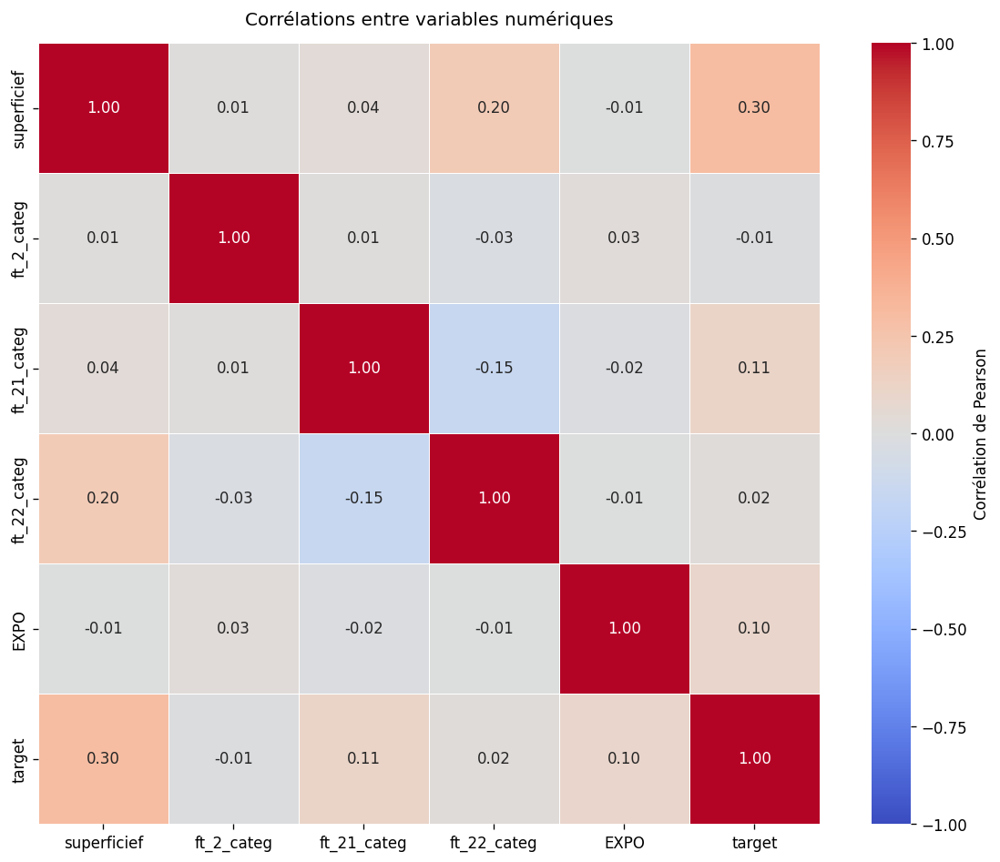

| Ce qu’on voit | Interprétation |
|---------------|----------------|
| Case `superficief` × `target` en couleur « chaude » | Lien **modéré positif** (~0,30) : plus grand ↔ un peu plus de sinistres (tendance, pas règle absolue). |
| `ft_21_categ`, `ft_19_categ` avec `target` | Corrélations plus faibles mais non nulles — pistes secondaires. |
| Variables entre elles | Si deux features sont très corrélées, une peut suffire (éviter la redondance). |

#### Superficie selon sinistre ou non

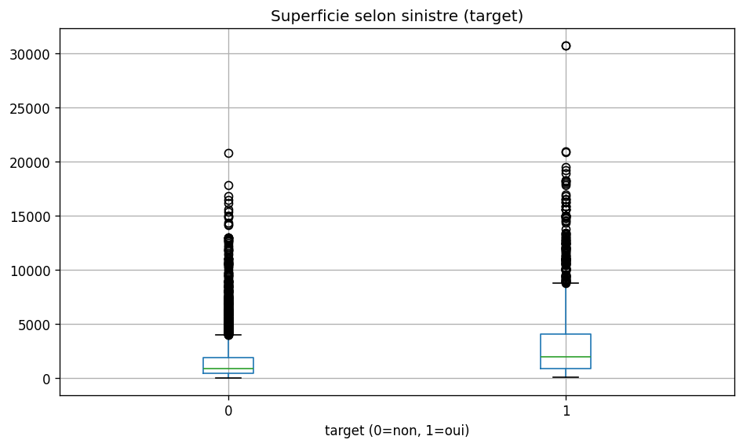

| Ce qu’on voit | Interprétation |
|---------------|----------------|
| Boîte `target = 1` un peu plus haute | Les bâtiments **avec sinistre** ont en médiane une **superficie plus grande**. |
| Beaucoup de chevauchement | La superficie **seule** ne sépare pas parfaitement les classes — il faudra d’autres variables + un vrai modèle. |
| Lien section 2 | Confirme visuellement la corrélation ~0,30 calculée plus tôt. |

#### Distributions globales (histogrammes)

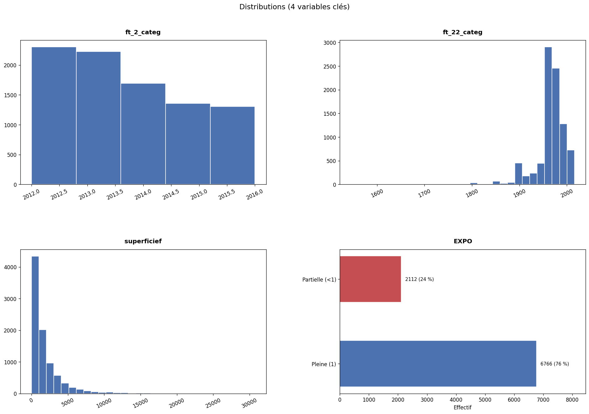

| Panneau | Interprétation |
|---------|----------------|
| **superficief** | Forte asymétrie : pic à gauche (petits bâtiments), longue traîne à droite. |
| **EXPO** | **~76 %** à **1** (année pleine) ; **~24 %** partiels, souvent proches de 1 ou répartis par tranches. |
| **ft_22_categ** | Forme « année de construction » — masse autour des années 1960–1980. |
| **ft_2_categ** | Années d’observation 2012–2016 — peu varié. |

---

### Déroulé dans `Projet.ipynb`

| Bloc | Cellules (indicatif) | Action |
|------|----------------------|--------|
| **3.1 Boxplots / histogrammes** | `describe`, boxplots | `superficief` (boxplot) ; `EXPO` (barres année pleine / partielle + tranches) ; histogrammes pour `ft_2_categ` (2012–2016) et `ft_22_categ` (années construction) |
| **Conversion EXPO** | remplacement `,` → `.`, `astype(float)` | Rendre `EXPO` exploitable numériquement |
| **Percentile manuel** | tri de `superficief`, 25ᵉ percentile | Illustration cours (lien boîte à moustaches / quartiles) |
| **Histogrammes** | `hist` sur 4 variables, puis `bins=3` | Vue d’ensemble des distributions |
| **3.2 Corrélations** *(ajout)* | `visualization.plot_corr` | Heatmap Pearson (seuil 0,05) sur 6 colonnes numériques + `target` |
| **3.3 Sinistre × superficie** *(ajout)* | `boxplot` par `target` | Comparer superficies selon sinistre ou non |
| **Scatter matrix** | `scatter_matrix` + `rotate_labels` | Relations par paires entre 4 variables |
| **Préparation modèle** | `df_cleaned` | Virgules → points, float, **one-hot** des catégorielles ; `Identifiant` exclu de l’encodage |

Les `!wget` de cette section ont été **retirés** (même logique que section 1).

### À quoi servent les graphiques / opérations

| Outil | Rôle |
|-------|------|
| **`df.describe()`** | Tableau quartiles / min / max avant de tracer. |
| **`df.boxplot()`** | Médiane, IQR, **outliers** (points au-dessus du mustache). |
| **`df.hist()`** | Répartition des valeurs ; `bins=3` pour une vue très agrégée. |
| **`plot_corr`** | Carte des corrélations : redondance entre features, lien avec `target`. |
| **`boxplot(..., by='target')`** | Comparer une feature selon la classe (sinistre ou non). |
| **`scatter_matrix`** | Nuages de points par paire de variables (corrélation visuelle). |
| **`pd.get_dummies`** | Transformer les `object` (V/N/O, codes INSEE, etc.) en colonnes 0/1 pour sklearn. |

### Ce qu’on a constaté

| Variable | Constat |
|----------|---------|
| **`superficief`** | Distribution **très asymétrique** : médiane ~1 075 m², Q3 ~2 289 m², **max ~30 745 m²** — nombreux outliers vers le haut ; 25ᵉ percentile manuel ≈ 530 m². |
| **`EXPO`** | Après conversion : **~76 %** des lignes à `EXPO = 1` (année complète) ; le reste entre 0 et 1 (contrats partiels). Boxplot peu informatif (Q1 ≈ Q3 ≈ 1). |
| **`ft_22_categ`** | Plage typique autour des **années 1960–2016** (souvent interprété comme année de construction) ; valeurs hautes regroupées au-dessus du 75ᵉ percentile. |
| **`ft_2_categ`** | Années d’observation **2012–2016** — peu de dispersion, boxplot peu utile. |
| **Sinistre × superficie** | Médianes plus élevées pour `target = 1` que pour `0` (cohérent avec corrélation ~0,30). |
| **`df_cleaned`** | **8 878 × 1 505** colonnes après one-hot sur **16** colonnes catégorielles — jeu prêt pour la régression / classification de la section 4. |

---

## 8 mai 2026 — Modélisation (section 4 du notebook)

### Ce qu’on voulait faire

Après avoir **exploré** les données (sections 2–3), on entraîne des **modèles** pour prédire `target` (sinistre ou non). Le notebook suit le plan du cours : d’abord des **régressions** (traiter la cible comme un nombre entre 0 et 1), puis de vrais **classifieurs** (logistique, forêt aléatoire).

### Comprendre simplement — « On teste des modèles prédictifs »

#### Idée générale

| Type | Analogie | Dans notre notebook |
|------|----------|---------------------|
| **Régression** | Deviner une **note** entre 0 et 1 (ex. 0,23 = « 23 % de risque ») | `AndreaLinearRegression` sur `superficief`, `EXPO`, polynômes… |
| **Classification** | Répondre **oui / non** sinistre | Régression logistique, forêt aléatoire |

Le challenge officiel utilise le **Gini** sur des **probabilités** ; le cours utilise souvent **RMSE** (régression) ou **accuracy** (classification).

#### 4.1 — Régression linéaire (une variable : superficie)

**Question :** peut-on prédire le sinistre seulement avec la superficie ?

**Exemple :** le modèle trace une **droite** : plus la surface augmente, plus la valeur prédite augmente (sans être limité à 0 ou 1).

| Résultat (notre run) | Valeur |
|----------------------|--------|
| **RMSE** (test) | **~0,40** |

Beaucoup d’erreur : la superficie **seule** ne suffit pas, mais elle apporte déjà un signal (cohérent avec l’EDA).

#### 4.2 à 4.5 — Aller plus loin (cours)

- **4.2** : `log(superficief)` pour réduire l’effet des très grands bâtiments  
- **4.3** : plusieurs variables en même temps  
- **4.4–4.5** : polynômes + **Ridge** (régularisation) pour limiter le sur-apprentissage  

On garde le code du notebook ; l’idée est de **comparer les RMSE** entre approches.

#### 4.6 — Régression logistique (vrai oui/non)

**Variables :** `superficief` + `EXPO`, données **normalisées**, puis **SMOTE** pour équilibrer l’entraînement (autant de 0 que de 1 dans le train).

| Situation | Accuracy (test, indicatif) |
|-----------|----------------------------|
| Sans SMOTE sur l’entraînement | **~0,77** |
| Avec SMOTE sur l’entraînement | **~0,70** |

**Lecture :** sans SMOTE, le modèle favorise la classe majoritaire (beaucoup de « pas de sinistre » bien classés). Avec SMOTE, il essaie mieux de détecter les sinistres, parfois au prix de l’accuracy globale — la **matrice de confusion** compte plus que un seul chiffre.

#### 4.7 — Forêt aléatoire

Beaucoup d’**arbres de décision** qui votent. Souvent plus fort que la logistique sur données tabulaires.

| Résultat (baseline rapide, SMOTE) | **~0,66** accuracy |
| Importances | `superficief` et `EXPO` ressortent (aligné avec le PDF du challenge) |

Le notebook enchaîne avec **RandomizedSearchCV** (recherche d’hyperparamètres) — plus long à exécuter.

**§4.8** (après la 4.7) : **~1500 features encodées**, **SMOTE dans le pipeline**, optimisation **Gini normalisé**, avec un **tableau de bord** en 4 panneaux (`plot_rf_classification_dashboard`).

### Exécution locale (Windows)

1. Sections **1 → 3** déjà faites.  
2. Cellule **« Prérequis section 4 »** + cellule **`df_train_cleaned`** (nouvelles).  
3. **Sauter** les cellules Colab qui rechargent CSV / `wget` (imports dupliqués).  
4. Enchaîner **4.1 → 4.7** ; installer si besoin : `pip install imbalanced-learn`

### Graphiques et interprétations (section 4)

> Le notebook est **autonome** : exécuter les cellules §4 (prérequis → 4.8 visualisation) génère les graphiques dans le notebook. Les scripts `run_section4_metrics.py` / `generate_figures.py` sont optionnels (README / export `figures/`).

#### Régression linéaire — superficie

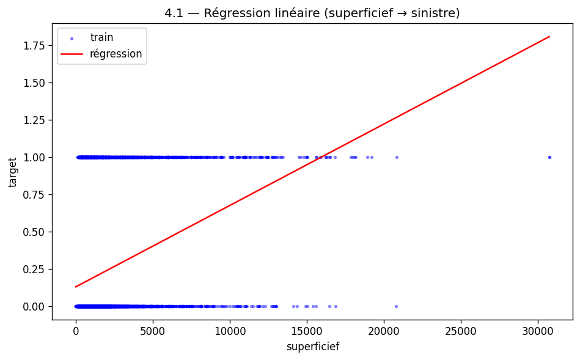

| Ce qu’on voit | Interprétation |
|---------------|----------------|
| Nuage bleu très dispersé | Un même superficie peut donner 0 ou 1 — le sinistre n’est pas déterministe par la taille seule. |
| Droite rouge qui monte | Tendance : **plus grand → risque un peu plus élevé** en moyenne. |

#### Logistique + SMOTE — courbes et matrice de confusion

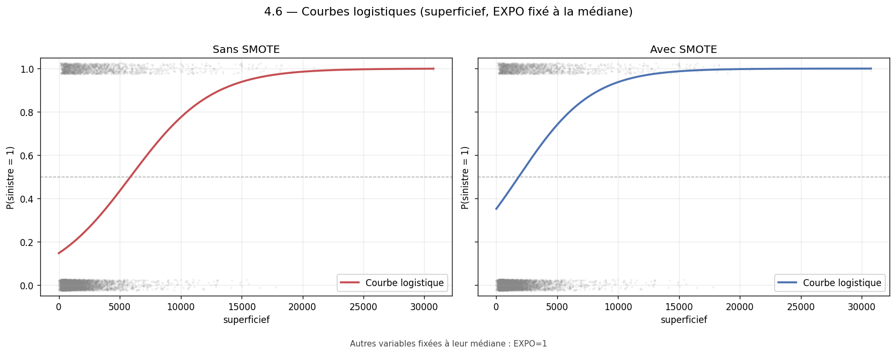

| Ce qu’on voit | Interprétation |
|---------------|----------------|
| Nuage gris (0 / 1) | Observations réelles selon `superficief` |
| Courbe sigmoïde | Probabilité \(P(\text{sinistre})\), bornée entre 0 et 1 |
| Sans SMOTE vs avec SMOTE | Le rééquilibrage remonte la courbe → plus de sinistres détectés, parfois au prix de l’accuracy globale |

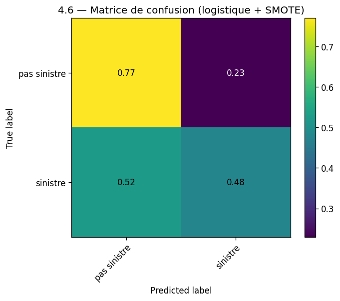

| Zone | Sens |
|------|------|
| Haut-gauche (vrais 0) | Bâtiments sans sinistre bien reconnus |
| Bas-droite (vrais 1) | Sinistres correctement détectés |
| Bas-gauche / haut-droite | Erreurs : faux positifs / faux négatifs |

#### Forêt aléatoire — matrice + importances

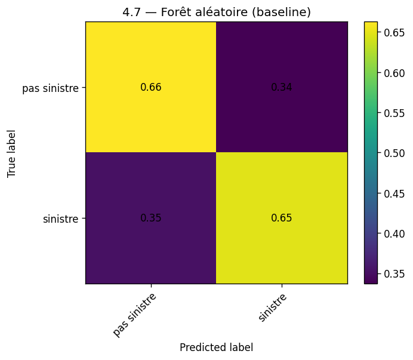

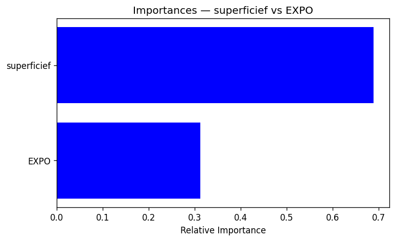

| Ce qu’on voit | Interprétation |
|---------------|----------------|
| Matrice RF | Performance du même ordre que la logistique sur ce run rapide ; le tuning du notebook peut faire mieux. |
| Barres d’importance | **`superficief`** et **`EXPO`** comptent le plus parmi les deux features testées ici. |

#### Forêt aléatoire — pipeline complet (Gini + SMOTE + features encodées)

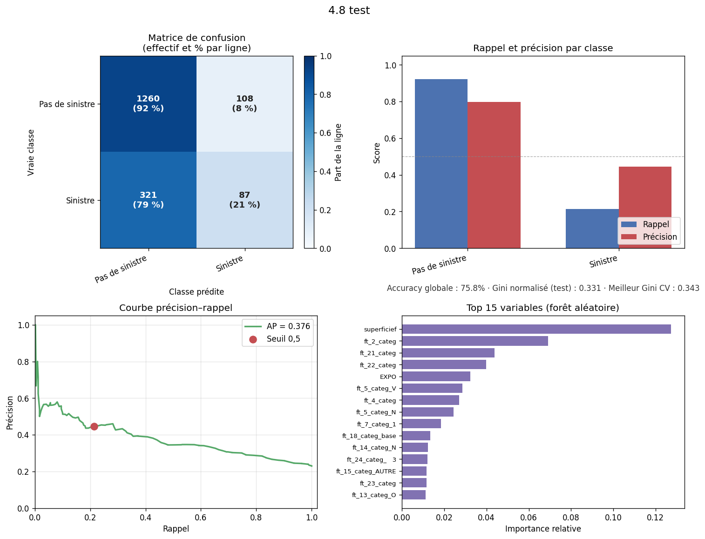

| Ce qu’on voit | Interprétation |
|---------------|----------------|
| Matrice (effectifs + %) | Lecture directe : sinistres détectés en bas-droite, fausses alertes en haut-droite. |
| Rappel / précision | Compromis par classe ; le **Gini normalisé** (sous-titre) est la métrique du challenge. |
| Courbe PR | Qualité du classement probabiliste ; point rouge = seuil 0,5. |
| Top importances | Variables les plus utilisées par les arbres sur l’ensemble encodé. |

### Déroulé des sous-sections (notebook)

| Section | Contenu |
|---------|---------|
| **4.1** | Régression linéaire univariée (`superficief`, `EXPO`) |
| **4.2** | Variable transformée (`log`) |
| **4.3** | Régression multivariée |
| **4.4–4.5** | Polynômes, Ridge, validation croisée |
| **4.6** | Logistique, normalisation, SMOTE, `plot_logistic_curves_compare`, `plot_conf_mat` |
| **4.7** | `RandomForestClassifier`, SMOTE, importances, `RandomizedSearchCV` (**score = Gini normalisé**) |
| **4.8** | Tableau de bord RF (`build_feature_matrices_nb`, `ImbPipeline` + Gini, `show_figure`) |

---

## 11 mai 2026 — Réseau de neurones (section 5 du notebook)

### Ce qu’on voulait faire

Tester un **perceptron multicouche (MLP)** : un réseau de neurones qui apprend des combinaisons non linéaires des entrées, sur le **même problème** que la régression logistique (sinistre oui/non), avec les mêmes variables `superficief` et `EXPO`, normalisation et **SMOTE**.

### Ce qui a été fait concrètement

| Action | Détail |
|--------|--------|
| Cellules ajoutées au notebook | Prérequis MLP (split 80/20, `StandardScaler`, SMOTE) avant les cellules MLP d’origine |
| Entraînement | `MLPClassifier` (2 couches de 40 neurones, activation `logistic`, early stopping) |
| Tuning | `RandomizedSearchCV` (8 combinaisons, 3 folds, score = **Gini normalisé**) |
| Figures | `05_mlp_confusion.png`, `05_mlp_tuning_scores.png` |
| Script | `python run_sections_5_6_submission.py` régénère figures + métriques |

### Comprendre simplement — « Un réseau de neurones, c’est quoi ? »

Imagine plusieurs **calculs en chaîne** : chaque couche transforme les entrées (superficie, exposition) puis la dernière couche donne une probabilité de sinistre. Contrairement à la **droite** de la régression logistique, le MLP peut courber la frontière de décision — utile si la relation n’est pas strictement linéaire.

| Élément | Rôle |
|---------|------|
| **Couches cachées** `(40, 40)` | Deux étages de 40 neurones qui mélangent les signaux |
| **Early stopping** | Arrêt automatique si le modèle n’améliore plus sur un petit jeu de validation interne |
| **SMOTE** | Même logique qu’en 4.6 : ne pas ignorer les sinistres rares à l’entraînement |

### Résultats (run local, script)

| Métrique | Valeur | Lecture |
|----------|--------|---------|
| Accuracy test (MLP + SMOTE) | **~0,69** | Comparable à la logistique avec SMOTE (~0,70) sur ce jeu réduit à 2 variables |
| Meilleur score CV (RandomizedSearch, **Gini**) | **~0,43** | Hyperparamètres optimisés pour le Gini, pas l’accuracy |
| Gini test (hold-out 2 variables) | **~0,43** | Même ordre de grandeur que la logistique sur ce jeu réduit |

> Le notebook d’origine propose une grille plus large (`n_iter` plus élevé) : plus long à lancer sur un PC ; le script utilise une version **allégée** pour documenter le pipeline.

### Graphiques et interprétations (section 5)

#### Matrice de confusion — MLP

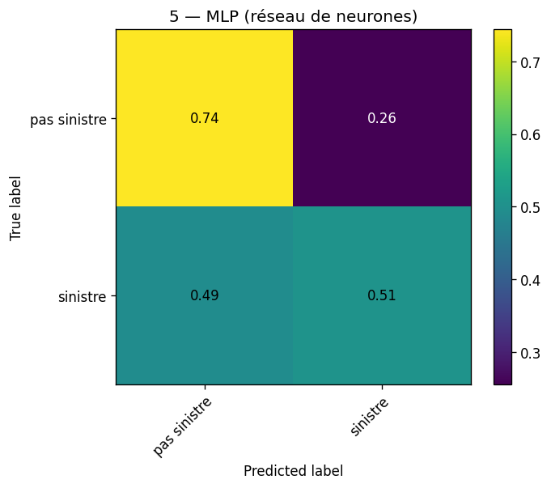

| Zone | Sens |
|------|------|
| Diagonale | Bonnes prédictions (0→0, 1→1) |
| Hors diagonale | Erreurs : prédire un sinistre à tort, ou en manquer un |
| vs logistique | Proportions du même ordre sur ce run — **2 features seules** limitent tout le monde |

#### Scores après recherche d’hyperparamètres

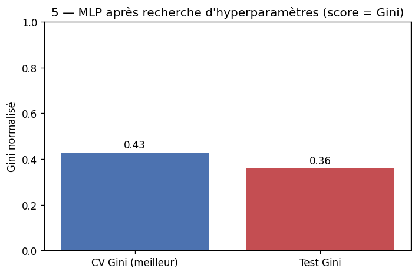

| Barre | Interprétation |
|-------|----------------|
| **CV (meilleur)** | Performance moyenne sur 3 découpes pendant la recherche |
| **Test** | Performance sur les 20 % laissés de côté au début — peut être **plus basse** (sur-apprentissage ou hasard du split) |

### Déroulé dans `Projet.ipynb`

| Bloc | Contenu |
|------|---------|
| Prérequis *(ajout)* | `cols_mlp`, split, scaler, SMOTE, `class_names` |
| MLP simple | `MLPClassifier` fit + `plot_conf_mat` |
| RandomizedSearchCV | Grille `hidden_layer_sizes`, `activation`, `alpha`, `learning_rate_init` |

---

## 13 mai 2026 — K-means (section 6 du notebook)

### Ce qu’on voulait faire

Regrouper les bâtiments en **K groupes** (clusters) sans utiliser `target`, pour voir si des profils naturels émergent (taille, année, exposition). C’est une approche **non supervisée** : utile pour l’exploration et, dans le cours, comme base pour la détection d’**anomalies** (bâtiments loin de leur cluster).

### Ce qui a été fait concrètement

| Action | Détail |
|--------|--------|
| Correction notebook | Suppression des `!wget` ; définition de `X` à partir de `df_train_cleaned` (5 variables numériques) |
| Variables | `superficief`, `ft_2_categ`, `ft_21_categ`, `ft_22_categ`, `EXPO` |
| K choisi | **K = 3** (comme le notebook d’origine) |
| Stabilité | Courbe **inertie** vs `n_init` ; choix `n_init = 80` |
| Qualité | **Score de silhouette** moyen + diagramme par cluster |
| Figures | `06_kmeans_inertia.png`, `06_kmeans_silhouette.png`, `06_kmeans_clusters_hist.png` |

### Comprendre simplement — « Clustering sans étiquette »

On ne dit pas au modèle qui a eu un sinistre : on lui demande seulement « regroupe les bâtiments **ressemblants** ». Ensuite on peut regarder si certains clusters ont plus de sinistres (analyse croisée) ou repérer des points **mal placés** dans leur groupe (anomalies).

| Concept | Analogie |
|---------|----------|
| **K-means** | Placer K « centres » et attribuer chaque bâtiment au centre le plus proche |
| **Inertie** | Somme des distances au centre — plus c’est bas, plus les groupes sont compacts |
| **Silhouette** | Entre -1 et 1 : un bâtiment est-il **bien** dans son cluster par rapport aux autres ? |

### Résultats (run local, script)

| Métrique | Valeur | Lecture |
|----------|--------|---------|
| Silhouette moyenne (K=3, sous-échantillon 8 000) | **~0,26** | Séparation **modeste** : les 3 groupes se chevauchent pas mal en 5D — normal sur des données réelles hétérogènes |
| Effectifs par cluster | Voir histogramme | Répartition pas forcément égale (contrairement à un 33/33/33 idéal) |

> Un score de silhouette **~0,7** apparaissait dans d’anciennes sorties Colab avec un autre sous-échantillon / prétraitement ; notre pipeline local documenté donne **~0,26** — à interpréter avec le même jeu et les mêmes features.

### Graphiques et interprétations (section 6)

#### Stabilisation de l’inertie

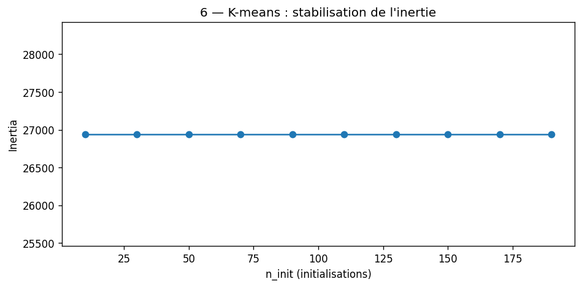

| Ce qu’on voit | Interprétation |
|---------------|----------------|
| Courbe qui se stabilise | Au-delà d’un certain `n_init`, relancer K-means plusieurs fois ne change presque plus le résultat |
| Choix `n_init = 80` | Compromis temps / stabilité (notebook) |

#### Diagramme de silhouette

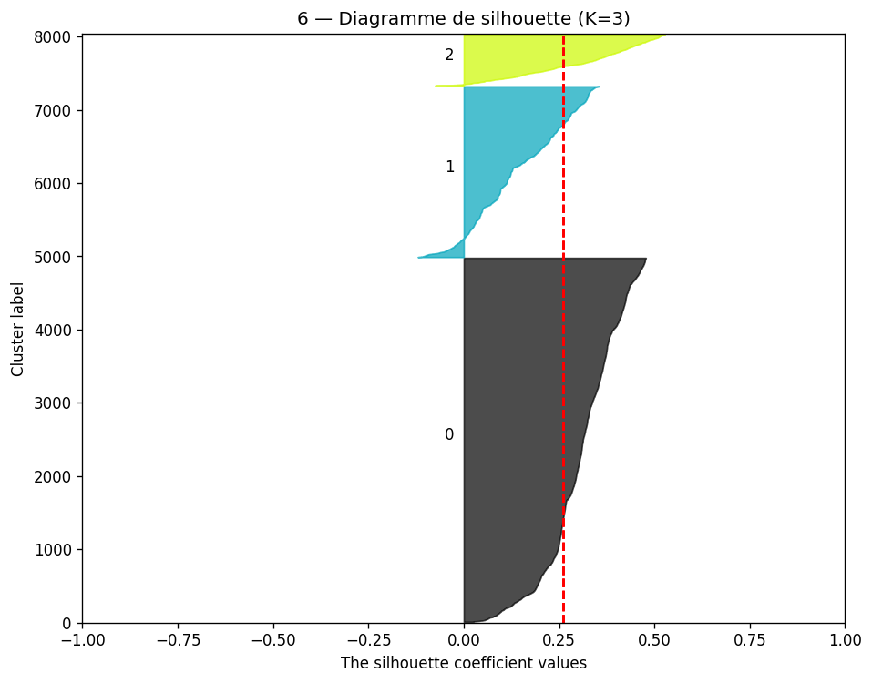

| Ce qu’on voit | Interprétation |
|---------------|----------------|
| Largeurs de barres par cluster | Clusters 0, 1, 2 n’ont pas la même « cohésion » interne |
| Valeurs proches de 0 | Beaucoup de points à la frontière entre deux groupes |

#### Répartition des effectifs

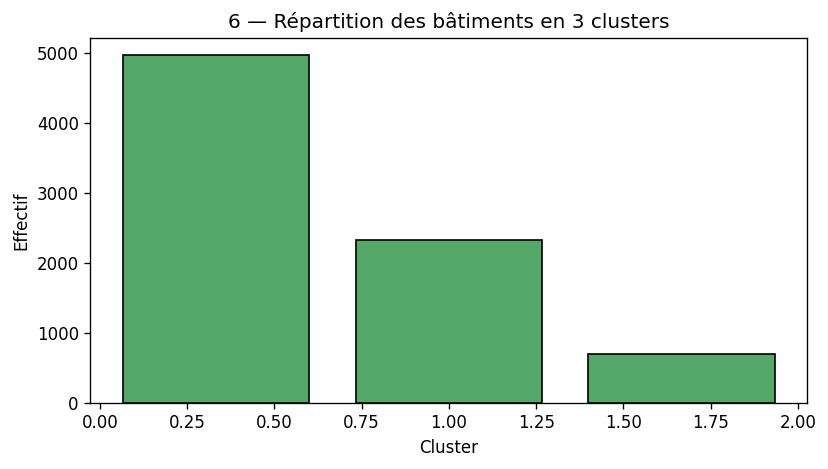

| Ce qu’on voit | Interprétation |
|---------------|----------------|
| Barres de hauteurs différentes | Un cluster peut regrouper **plus** de bâtiments (ex. petits bâtiments récents) |

### Déroulé dans `Projet.ipynb`

| Cellule (indicatif) | Action |
|---------------------|--------|
| Prérequis *(ajout)* | Markdown + code : `X`, `X_scaled`, premier `fit_predict` |
| `clusters[0:5]`, `hist` | Inspection rapide |
| Boucle `n_init` | Courbe inertie |
| `silhouette_score` + `silhouette_diagram` | Qualité des clusters |

---

## 15 mai 2026 — Soumission challenge (fichier `submission_proba.csv`)

### Ce qu’on voulait faire

Produire un fichier **soumission** pour [Challenge Data](https://challengedata.ens.fr/) : une ligne par bâtiment de `X_test`, colonnes `Identifiant` et **`target` = probabilité** (entre 0 et 1) d’au moins un sinistre — **pas** un 0/1 dur.

### Ce qui a été fait concrètement

| Action | Détail |
|--------|--------|
| Module | **`ml_pipeline.py`** — encodage train/test, métrique Gini, `make_submission()` |
| Modèle retenu | `RandomForestClassifier` + **SMOTE**, tuning **RandomizedSearchCV** (score = **Gini normalisé**) |
| Prétraitement | Logique **`df_cleaned`** complète (~**1 503** colonnes) ; imputation sur le train, **aucun dropna** sur le test |
| Fichier généré | **`submission_proba.csv`** — **3 412** lignes (100 % de `X_test`) |
| Validation interne | Hold-out 20 % du train : **Gini normalisé ~0,33** ; meilleur score CV ~**0,35** (indicatif) |
| Figure | `07_submission_proba_hist.png` — distribution des probabilités sur le test |
| Notebook | Section **7** ajoutée dans `Projet.ipynb` (cellules soumission + histogramme) |

### Comprendre simplement — Gini et probabilités

| Idée | Explication |
|------|-------------|
| **Probabilité** | Ex. `0,47` = « environ 47 % de chance d’avoir au moins un sinistre » selon le modèle |
| **Gini normalisé** | Mesure si les bâtiments **à risque** sont bien **en haut** de votre liste triée par probabilité décroissante |
| **Pas la même chose que l’accuracy** | Vous pouvez avoir une accuracy correcte mais un mauvais Gini si l’**ordre** des risques est mauvais |

Formule dans **`ml_pipeline.py`** : Gini du modèle divisé par le Gini d’un **classeur parfait** (même formule que les challenges type assurance / Kaggle). Le tuning (RF et MLP) utilise ce score, pas l’accuracy.

### Fichier de soumission

```text
Identifiant,target
16872,0.47441869520675667
16852,0.6998356327723155
...
```

| Colonne | Contenu |
|---------|---------|
| `Identifiant` | Clé du bâtiment (comme dans `X_test.csv`) |
| `target` | **Probabilité** prédite ∈ [0, 1] |

### Distribution des probabilités (test)

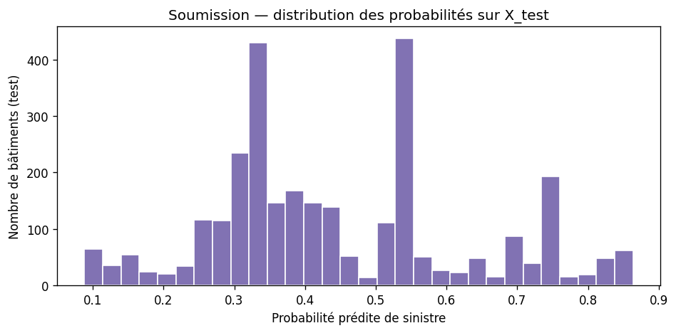

| Ce qu’on voit | Interprétation |
|---------------|----------------|
| Beaucoup de valeurs basses à modérées | Le modèle est **prudent** sur la majorité du parc |
| Queue vers 1 | Quelques profils jugés plus risqués — utiles pour le **tri Gini** |
| 3 412 bâtiments | Couverture **complète** du fichier test (imputation train, pas de `dropna` sur le test) |

### Comment régénérer

```bash
pip install pandas numpy matplotlib scikit-learn imbalanced-learn scipy
python run_sections_5_6_submission.py
```

Produit : figures `05_*`, `06_*`, `07_*` + `submission_proba.csv` + métriques affichées dans le terminal.

---

## Fichiers du dépôt (hors données)

| Fichier | Note |
|---------|------|
| `Projet.ipynb` | Fil principal — EDA, régressions, classification, MLP, K-means, **soumission (§7)** |
| `Forêt aléatoire.ipynb` | Variante exploratoire centrée forêt aléatoire |
| `dimensionality-reduction.ipynb` | Variante avec réduction de dimension (SVD) |
| `ml_pipeline.py` | Prétraitement train/test, Gini normalisé, génération `submission_proba.csv` |
| `figures/` | Graphiques intégrés au README (sections 2 à 7) |
| `generate_figures.py` | Régénère les figures des sections 2–3 |
| `run_section4_metrics.py` | Régénère les figures + métriques clés de la section 4 |
| `run_sections_5_6_submission.py` | Sections 5–6–7 + `submission_proba.csv` + figures 05–07 |
| `submission_proba.csv` | Fichier de soumission (**3 412** probabilités sur `X_test`) |

---

## Historique des entrées

**1 mai 2026** — Initialisation terminée en local ; notebook complété (cellules `urllib` + chargement CSV) ; premier passage du journal dans ce README.  
**3 mai 2026** — Section 2 visualisation : enrichissement du notebook (`df_raw`, manquants, déséquilibre, corrélations) ; journal README mis à jour.  
**5 mai 2026** — Section 3 graphiques : conversion `EXPO`, boxplots, heatmap, scatter matrix, `df_cleaned` ; README mis à jour.  
**6 mai 2026** — Ajout des explications vulgarisées (sections 2 et 3) pour l’équipe dans le README.  
**7 mai 2026** — Graphiques exportés dans `figures/` + interprétations intégrées au README (`generate_figures.py`).  
**8 mai 2026** — Section 4 modélisation : entrée locale Windows, figures 04_*, README vulgarisé (`run_section4_metrics.py`).  
**11 mai 2026** — Section 5 (MLP) : prérequis notebook, figures 05_*, README section 5 (`run_sections_5_6_submission.py`).  
**13 mai 2026** — Section 6 (K-means) : correction `wget`, figures 06_*, README section 6.  
**15 mai 2026** — Soumission challenge : pipeline `ml_pipeline.py`, **3 412** lignes, tuning Gini, section 7 notebook, figure 07.
